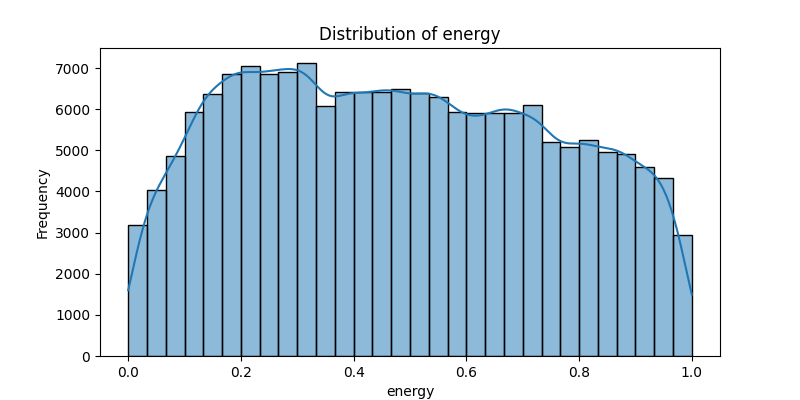
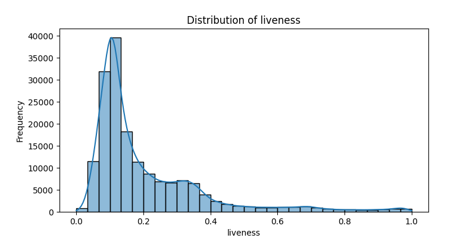

# Music Recommendation System Documentation


## 1 Environment Setup

Execute the following commands to create, activate, and configure the required conda environment:

```bash
conda create --name music_recommendation python=3.8
conda activate music_recommendation

conda install -c conda-forge pandas numpy matplotlib seaborn scikit-learn joblib beautifulsoup4 imbalanced-learn lxml
```
If you solely use the RUN button on the vscode in mac to run train.py and music_recommendation.py, it is probably going to show error of package not download. In this situation, press Cmd+Shift+P to open the Command Palette, type and select "Python: Select Interpreter", choose the one that shows "music_recommendation" in its path since the conda has already created the python 3.8 version and also conda install all packages needed in the project. 


## 2 Data Preparation

In [Code address](https://www.kaggle.com/code/ruhamayohannes/personalized-music-mood-recommender-2/notebook), download the dataset which appears in the input folder：


## 3 Project Structure Preview

The following shows the structure of the code，input stores the input data, output stores the trained models, encoders, intermediate data, and some data，scripts contains the code for data loading and processing, model implementation, and utility functions, train.py is the training code, music_recommendation.py is the music recommendation code.


Overall approach: Predict the user's emotion based on their behavior, and test on the song dataset to select the top 10 songs with the highest predicted score for that emotion.

The recommendation process can be divided into four steps:

1、Train an emotion prediction model.
User behavior is used as input features, and user emotions serve as the labels.

2、Perform KMeans clustering on the song dataset.
Since the song data does not have emotion labels, we extract some informative features from the songs and apply KMeans clustering. The resulting cluster centers are compared with a predefined threshold to assign an emotion label to each song.

3、Train a song emotion prediction model.
Using the emotion labels obtained from the KMeans clustering, train a model to predict emotions for songs.

4、Music recommendation.
Use the emotion prediction model to infer the user's current emotion, and the song emotion prediction model to estimate each song’s emotional category. Then recommend the top 10 songs that best match the user's predicted emotion.


## 4 Training

Run the following command to start training:

```bash
python train.py
```


After execution, the following will be generated under the output folder: Confusion matrices and error analysis plots for both the user behavior emotion prediction model and the music emotion prediction model, clustered_songs.csv, which contains the results of KMeans clustering, kmeans_cluster_scatter, a scatter plot visualizing the KMeans clustering, The trained models and label encoders, spotify_statistics_visualization, which stores a series of visualizations for data statistics


| music_runs         | user_behavior_runs |
| ------------------ | ------------------ |
|  |  |
|  |  |

KMeans clustering scatter plot：


Statistical data visualizations stored in spotify_statistics_visualization：

| correlation_heatmap                | pairplot                                  |
| ---------------------------------- | ----------------------------------------- |
|  |  |

|  |                     |       |  |
| --------------------------------------- | ----------------------------------------------------- | ------------------------------------ | ------------------------------------ |
|        |  |  |                                    |


## 5 Music recommendation

Run the following command to start music recommendation:

```bash
python music_recommendation.py
```


In the code, the output uses the emotion of the first user as an example:


Recommendation process:

First, the predicted emotion results for user behaviors in the dataset are output. Then, for a selected user, the system recommends the top 10 songs based on their predicted emotion.

In this example, the user's predicted emotion is Sadness or Melancholy.
Based on this, the system recommends the top 10 songs with the highest scores for the melancholy emotion label.


